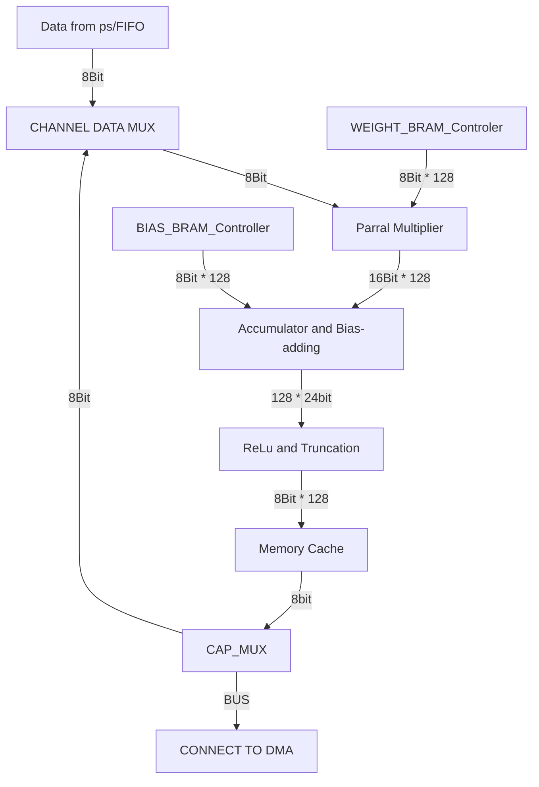

# FC_ACCEL_LITE

**电子科技大学 2025年秋季学期 ASIC设计 大实验项目与作业**  
Vivado 版本: <mark>2024.02 </mark>  
FIFO，BRAM，Mulitplier均是Xilinx/AMD的IP
  
## 系统架构 
 



### 系统特性:  

* 采用valid_ready的握手流程，支持反压。时序参照了AXI的握手部分可以兼容
* 可以用编写指令兼容更复杂的FC/CNN等
* 通道配置可以降低不必要的资源节省功耗，有较多复用结构
* 架构可扩展性好。比如可以加强Memorycache支持寻址可以配合多层同时计算等
* 可以通过配置宏，更改ASIC所支持的模型规模。同时Controler可以用简易控制命令编程


## 目前模块状态

|  模块名称  |   完成情况   |   具体说明   |
|:-----:|:----------:|:------:|
| ReLu和截位模块|测试通过||
|BIAS_BRAM_Controller|测试通过||
|乘法器|测试通过||
|缓存模块|测试通过||
|累加器和缓存|通过|疑似敏感信号问题|
|控制器和数据通路|等待测试||


## Vivado 的奇怪行为
对比下面两个代码块
```
// 代码1
reg [CHANNEL_DATAWIDTH*CHANNEL_NUM-1:0] bias_buf;
    wire [CHANNEL_DATAWIDTH*CHANNEL_NUM-1:0] w_bias_buf;
    assign w_bias_buf = i_bias_in;
    always @(posedge clk or negedge rst_n) begin
        if(!rst_n) begin
            bias_buf <= {(CHANNEL_DATAWIDTH*CHANNEL_NUM){1'b0}};
            o_bias_in_ready <= 1;
        end
        else if(bias_fire) begin
            bias_buf <= w_bias_buf;
            o_bias_in_ready <= 0;
        end
        else if(data_out_fire)begin
            o_bias_in_ready <= 1;
        end
    end

//代码2
reg [CHANNEL_DATAWIDTH*CHANNEL_NUM-1:0] bias_buf;
    wire [CHANNEL_DATAWIDTH*CHANNEL_NUM-1:0] w_bias_buf;
    assign w_bias_buf = i_bias_in;
    always @(posedge clk or negedge rst_n) begin
        if(!rst_n) begin
            bias_buf <= {(CHANNEL_DATAWIDTH*CHANNEL_NUM){1'b0}};
            o_bias_in_ready <= 1;
        end
        else if(bias_fire) begin
            bias_buf <= i_bias_in;
            o_bias_in_ready <= 0;
        end
        else if(data_out_fire)begin
            o_bias_in_ready <= 1;
        end
    end

```  
代码1的能正常锁存但是代码2的不能锁存


  
由于乘法器数据同步没有设计到位，出现数据输入握手的问题，乘法器无法正确获取数据，故结果错误。但是模块运行波形有正确的重新配置和计算处理，以及输出。
